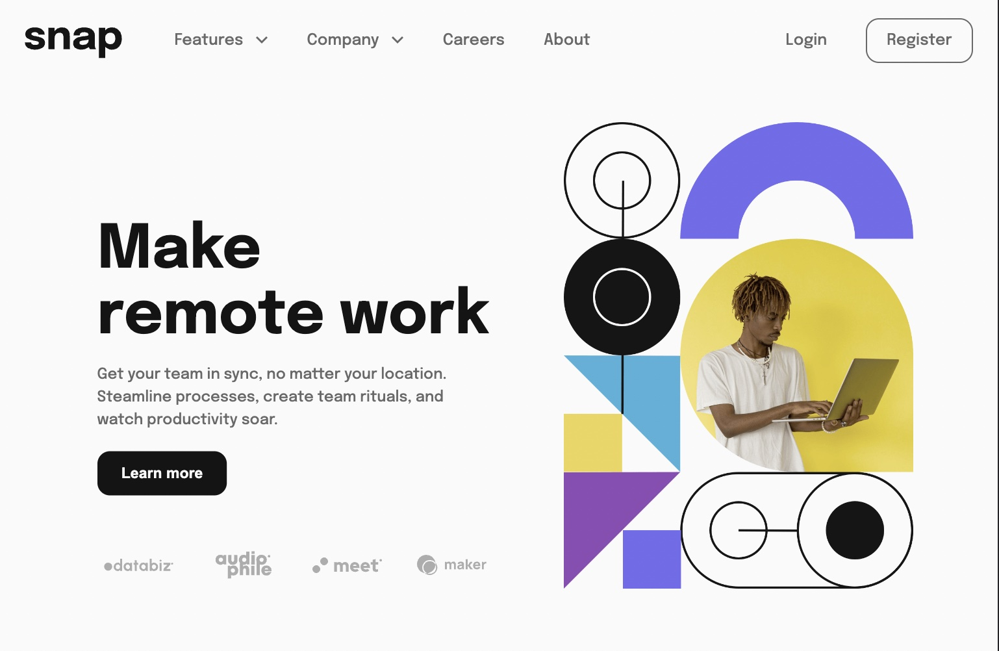

# Frontend Mentor - Intro section with dropdown navigation solution

This is a solution to the [Intro section with dropdown navigation challenge on Frontend Mentor](https://www.frontendmentor.io/challenges/intro-section-with-dropdown-navigation-ryaPetHE5). Frontend Mentor challenges help you improve your coding skills by building realistic projects. 

## Table of contents

- [Overview](#overview)
  - [The challenge](#the-challenge)
  - [Screenshot](#screenshot)
  - [Links](#links)
- [My process](#my-process)
  - [Built with](#built-with)
  - [What I learned](#what-i-learned)
  - [Continued development](#continued-development)
  - [Useful resources](#useful-resources)
- [Author](#author)

## Overview

### The challenge

Users should be able to:

- View the relevant dropdown menus on desktop and mobile when interacting with the navigation links
- View the optimal layout for the content depending on their device's screen size
- See hover states for all interactive elements on the page

### Screenshot



### Links

- [Frontend Mentor Submission](https://www.frontendmentor.io/solutions/intro-section-with-dropdowns-qg1jaKJv5s)
- [Live Site](https://jacob-dunbar.github.io/intro-section-with-dropdowns/)

## My process

### Built with

- HTML5
- CSS
- Flexbox
- JavaScript


### What I learned

This challenge was my first attempt at dropdown menus, which are a very common and important design pattern. I tried several different techniques before selecting the method I used. I'm not sure that this is the most effective way, but I certainly learned a lot about the EventListener() method and .classList property on JavaScript, as well as the CSS transitions and position properties, variables and pseudo-classes. 

I also expanded on what I have already learned about responsive design, and especially how that relates to navigation (switching from a nav bar to a hamburger menu etc). Using the CSS aspect ratio property and clamp() function was really helpful in making this page responsive, and I really enjoyed learning how they work and implementing them in my project.

```css
.content .content-left h1 {
  font-size: clamp(1rem, 6vw, 3.9rem);
  line-height: 1.1;
}
```
```css
.content {
  width: 87.5%;
  margin: auto;
  aspect-ratio: 16 / 9;
}
```


### Continued development

Whilst I learned a lot from this project, it also highlighted some areas for improvement for me. I used flexbox for the main layout of this page, but I think that CSS Grid may have been a better choice. I have yet to delve into Grid but will set aside some time to learn it so that I can implement it in a future project.

This project also got me thinking about the possibility of using frameworks like React, and how such a framework might help my developer experience. I will definitely learn React in the future, once I have gained more proficiency in JavaScript.


### Useful resources

- [Let's Learn About Aspect Ratio In CSS](https://ishadeed.com/article/css-aspect-ratio/) - This article about aspect ratio from Ahmad Shadeed was really helpful, as it not only explained how to implement it in CSS, but also what aspect ratio is and how it works. This was the first time I came across Ahmad Shadeed's site, but have since been back and found his articles really interesting and informative.
- [HTML CSS and Javascript Website Design Tutorial - Beginner Project Fully Responsive](https://www.youtube.com/watch?v=FazgJVnrVuI) - I actually followed and completed this tutorial from Brian Design on youtube in preparation for this challenge, as I could see it had many of the same features and requirements. This gave me many of the tools I needed to complete the challenge, and the repetition of the techniques really help cement them in my mind. Repetition is the key to mastery.


## Author

- Frontend Mentor - [@Jacob-Dunbar](https://www.frontendmentor.io/profile/Jacob-Dunbar)

